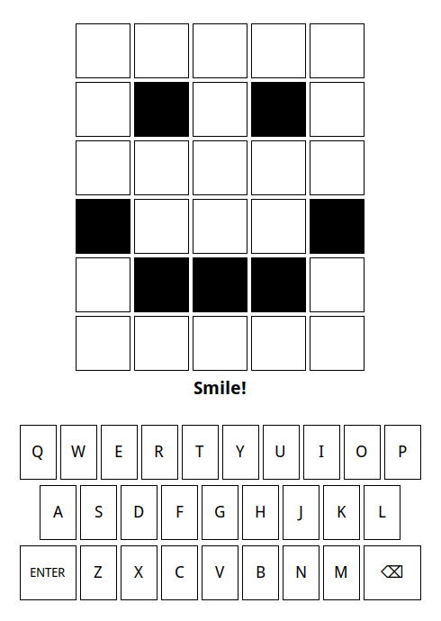

## Problem 1
- Everyone has experienced the drama of being forced to generate a new password with certain characteristics
- Here, your goal is to make use of the random library to generate a password of an arbitrary length and using a selection of characters
- Write a function `generate_password(length, chars)` which takes two arguments:
  - The length of the desired password as an integer
  - The string of possible characters to generate the password from
- Your function should _return_ the final password as a string


## The String Library
:::{style='font-size:.9em'}
- If you want an easy way to generate strings of different types, Python's `string` library can be useful
- It exports several useful constant strings that you can use:
  - `ascii_letters`: All the lowercase and capital english letters
  - `digits`: All the numeric digits
  - `punctuation`: All the punctuation symbols
- You can thus produce a simple password: 
  ```python
  generate_password(5, string.ascii_letters)
  ```
- Or a more difficult password: 
  ```python
  generate_password(15, string.ascii_letters + string.digits)
  ```

:::

## Password Key
```{.mypython style='max-height:800px; font-size:.8em;'}
import random

def generate_password(length, characters):
  """
  Generates a password of desired length from 
  provided characters. 
  """
  password = ""
  for i in range(length):
    password += random.choice(characters)
  return password


if __name__ == '__main__':
  import string

  chars = string.ascii_letters
  print(f"Simple password:  {generate_password(5, chars)}")
  chars += string.digits
  print(f"Medium password:  {generate_password(10, chars)}")
  chars += string.punctuation
  print(f"Complex password: {generate_password(15, chars)}")
```

## Problem 2: Coloring
- The most difficult part of the Wordle project is Milestone #2, in which you decide what color to apply to each of the squares in the guess.
- Here, your job is to work out the algorithm you need to determine what color each letter needs to be, but not write any actual code
- The goal is to produce a detailed description of the algorithm in pseudocode or diagram form


## Consideration #1
- You need to determine **all** the green squares before trying to assign squares to the color yellow.
- Why? What can happen if you decide to color each square one at a time, from front to back?

<div class="fragment">


</div>

## Consideration #2
- It is useful to keep a separate string of what letters are still available to be matched, rather than always comparing directly to the hidden word.
- Why?

<div class="fragment">


</div>


## Pseudocode Solution
```{.mypython style='max-height:900px' data-line-numbers=1-13|3-6|7-13}
def color_squares():
  |||Define a variable to represent the as-yet-unmatched letters|||
  for |||each letter position in the word|||
    if |||the letter in that position matches the hidden word:|||
      |||Color that square green|||
      |||Take that letter out of the unmatched collection|||
  for |||each letter position in the word:|||
    if |||the square in that position is not already colored|||
      if |||the letter in that position is in the unmatched collection:|||
        |||Color that square yellow|||
        |||Take that letter out of the unmatched collection|||
      else:
        |||Color that square gray|||
```


## Unmatched Tactics
:::{style="font-size:.9em"}
To implement the collection of unmatched letters:

- Create a variable called `unmatched` that contains all the letters in the hidden word that have yet to be matched. At the start of the process, this variable should equal the hidden word
- Each time you decide on the color of a letter, remove that letter from the `unmatched` string
  - You can not subtract letters from a string, so the easiest way is to use `replace` to swap out the letter for some other non-alphabetic character
  - `replace` will usually replace **all** the letters, which isn't wanted here. So you can specify that you want it to only replace the first occurrence by including the max count of 1 as a third argument.
    ```python
    unmatched = unmatched.replace(letter, "_", 1)
    ```
:::

## Problem 3
::::::cols
::::col


::::

::::col
- Interacting with the `WordleGWindow` object is mandatory in the Wordle project as a means to control or get information from the graphical window
- Displaying or reading information from the graphical squares generally requires referencing an index for both the column and row

```python
gw.set_square_letter(0,1,"A")
gw.get_square_letter(4,3)
```
::::
::::::


## Turn that frown...
::::::cols
::::{.col style='font-size:.9em'}
- For the first part of this problem, add code to the existing template so that when the program is run, the Wordle squares immediately form a frowning face, as shown to the right
- For the square color, you can just use the string `"black"` (or choose any other fun color!)
- The `.set_square_color(row, col, color)` method will be most useful here!

::::

::::col


::::
::::::

## Upside Down!
::::::cols
::::col
- Now add code to the `enter_action()` function so that, then the `Enter` or `Return` key is pressed, the sad face turns into a smiley face
- You don't need to change **ALL** of the squares here, so just change the ones that you need to
::::

::::col

::::
::::::
